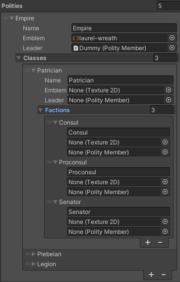
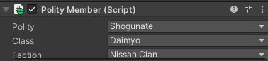

### Polity Manager - Manage Factions, Teams & Families

<!-- 1. [Description](#description)
   - [Use Cases](#use-cases)
2. [Requirements](#requirements)
3. [Quickstart](#quickstart)
4. [Public APIs](#public-apis)
5. [Advanced](#advanced)
   - [Families](#families)
   - [Leaders](#leaders)
6. [Credits](#credits)
7. [Glossary](#glossary) -->

- [Description](#description)
  - [Use Cases](#use-cases)
- [Requirements](#requirements)
- [Quickstart](#quickstart)
- [Public APIs](#public-apis)
  - [PolityManager.cs](#politymanagercs)
    - [ModifyPolityRelation()](#modifypolityrelation)
    - [GetPolityRelation()](#getpolityrelation)
    - [GetPolityEmblem()](#getpolityemblem)
    - [GetPolityLeader()](#getpolityleader)
    - [AddFactionToPolity()](#addfactiontopolity)
    - [RemoveFactionFromPolity()](#removefactionfrompolity)
    - [SerializePolityMatrix()](#serializepolitymatrix)
    - [DeserializePolityMatrix()](#deserializepolitymatrix)
  - [PolityMember.cs](#politymembercs)
    - [ChangeMemberPolity()](#changememberpolity)
    - [SetAsPolityLeader()](#setaspolityleader)
    - [GetMemberPolity()](#getmemberpolity)
    - [GetMemberFamily()](#getmemberfamily)
  - [Events](#events)
    - [OnRelationChange](#onrelationchange)
    - [OnFactionChange](#onfactionchange)
  - [Structs](#structs)
    - [PolityStruct](#politystruct)
    - [FamilyStruct](#familystruct)
- [Extra Settings](#extra-settings)
  - [Families](#families)
    - [Root Node](#root-node)
    - [Limitations](#limitations)
  - [Leaders](#leaders)
- [Credits](#credits)
- [Glossary](#glossary)

## Description

Polity Manager is an editor based tool designed to manage relations between polities in a centralized matrix, along with individual family relations through a simple node graph.

The PolityManager singleton contains a _Polity Relation Matrix_, a grid table that displays the relation of one polity to another based on their matrix position, similar to the Unity physics collision matrix.
>
>The Red Team is allied to the Blue Team, but are enemies to the Orks and the Shogunate.

A Polity1 also contains a serialized array of Class2 objects, and each Class object has a List of Faction3 objects. These serve to departmentalize the various branches or groups of your polity into smaller, more manageable units.
>
Each political unit, from the Polity to Faction, can be given a name, Texture2D emblem and a PolityMember leader.

To connect these polities to a prefab GameObject, the `PolityMember.cs` component is attached to that GameObject which will now assign it to a created polity, along with their class and faction (note that the class and faction will create an empty selection first, in case the PolityMember does not want to be affiliated with a class or faction).
>
>The Shogunate polity has a Daimyo class, and that class contains a faction called the Nissan Clan.

### Use Cases

Polity Manager is suited for games that needs to manage various groups of NPCs, especially when these relationships are a bit more complex, such as when one NPC needs to react to an enemy of one or more allied NPCs. However, it can also be applicable to simple teams or solo duels.

## Requirements

Requires the [`Newtonsoft.JSON`](https://www.newtonsoft.com/json) package to work.
Enter `com.unity.nuget.newtonsoft-json` into `Add Package by Git URL` using the Unity UPM

## Quickstart

1. Play the Example Demo.unity Scene
2. Click on the PolityManager GameObject in the hierarchy
3. Click on the grid cells in the _Polity Relation Matrix_ to change RelationType4 between polities.
   - NPCs will react by targeting enemies or enemies of allies.
4. Hover your mouse over an NPC to view their selected polity and family.

This should demonstrate a very basic implementation of how the PolityManager can control NavMeshAgents with a PolityMember that can react to relationship changes based on their current polity.
You can open the `NPC_Driver.cs` class inside of Example/Scripts to get a better idea of how the class subscribes to events and how it calls public PolityManager methods.

## Public APIs

All classes in this package is under the `KhiemLuong` namespace.

### PolityManager.cs

All public methods can be called from this PolityManager Singleton, referenced as `PM`, for example PM.ModifyPolityRelation();

#### ModifyPolityRelation()

Sets a new relationship status between two polities based on their names, adjusting their relation to either Neutral, Allies, or Enemies.
If the polities matched, the OnPolityRelationChange event will be invoked to notify all subscribers of the relation change.

| Parameter          | Type             | Description |
|--------------------|------------------|-------------|
| `polityMember`     | `PolityMember`   | The member of the polity initiating the relationship change. |
| `theirPolityName`  | `string`         | The name of the polity that is targeted for the relationship change, retrieved from `polityName` in `PolityMember`. |
| `factionRelation`  | `PolityRelation` | The new relation to set; can be `Neutral`, `Allies`, or `Enemies`. |

#### GetPolityRelation()

Compares the PolityRelation of the polityName to the second polityName and returns the enum that indicates their PolityRelation if found.
The overload method replaces the PolityMember parameters as strings representing the polityName.

| Parameter          | Type             | Description |
|--------------------|------------------|-------------|
| `polityMember`     | `PolityMember`   | The member of the polity initiating the relationship comparison. |
| `theirPolityMember`  | `PolityMember`         | The name of the polity that is targeted for comparison, retrieved from `polityName` in `PolityMember`. |

**Returns**
The `PolityRelation` enum value, which can be `Neutral`, `Allies` or `Enemies`.

#### GetPolityEmblem()

Gets the current Texture2D emblem of the political unit which you want, depending on whether you provide more than just the polityName.
Meaning if you also provide a className and factionName, it will return that faction's emblem instead.
| Parameter          | Type             | Description |
|--------------------|------------------|-------------|
| `_struct`     | `PolityStruct`   | The PolityStruct which must include a polityName, and optionally a class and faction. |

**Returns**
The `Texture2D` of that political unit's emblem

#### GetPolityLeader()

Gets the current leader of the political unit which you want, depending on whether you provide more than just the polityName.
Meaning if you also provide a className, it will return that class leader instead.
| Parameter          | Type             | Description |
|--------------------|------------------|-------------|
| `_struct`     | `PolityStruct`   | The PolityStruct which must include a polityName, and optionally a class and faction. |

**Returns**
The `PolityMember` of that political unit's leader

#### AddFactionToPolity()

Determines the polity and class based on the PolityStruct parameter, and searches through the factions List inside that polity's class, adding one if a faction was not found.
A Texture2D and PolityMember can be given as overload parameters to set it as the new faction's emblem and leader.
| Parameter          | Type             | Description |
|--------------------|------------------|-------------|
| `_struct`     | `PolityStruct`   | The PolityStruct which must include a polityName, className and factionName. |
| `emblem`  | `Texture2D`         | The image which the new Faction's emblem will be. |
| `leader`  | `PolityMember` | The leader of this new Faction. |

#### RemoveFactionFromPolity()

Removes a faction of a polity, if the PolityStruct polityName, className and factionName all match.
| Parameter          | Type             | Description |
|--------------------|------------------|-------------|
| `_struct`     | `PolityStruct`   | The PolityStruct which must include a polityName, className and factionName. |

#### SerializePolityMatrix()

Calls `JsonConvert.SerializeObject` on the relationships `PolityRelation[,]` matrix
**Returns**
The `string` of that serialized matrix.

#### DeserializePolityMatrix()

Calls `JsonConvert.JsonConvert.DeserializeObject<PolityRelation[,]>` on a string representing the PolityRelation matrix.
An overload method can accept any string, as long as it represents a matrix.
**Returns**
The `PolityRelation[,]` matrix which was deserialized from the string.

### PolityMember.cs

A non-serialized MonoBehaviour class which communicates with the PolityManager Singleton to retrieve its polities, classes and factions which can be set for the specific GameObject that it is attached to.

#### ChangeMemberPolity()

Changes the current PolityMember's polity, class and faction based on what parameters were provided.
| Parameter          | Type             | Description |
|--------------------|------------------|-------------|
| `_struct`     | `ref PolityStruct`   | The PolityStruct which must include a polityName, and optionally a class and faction. Passed in as a  `ref` so the change is applied to the PolityMember.|

#### SetAsPolityLeader()

Sets a new leader for the polity, or its class and faction to the PolityMember which called the method.
| Parameter          | Type             | Description |
|--------------------|------------------|-------------|
| `_struct`     | `PolityStruct`   | The PolityStruct which must include a polityName, and optionally a class and faction. |

#### GetMemberPolity()

**Returns**
The `PolityMember`'s `PolityStruct`.

#### GetMemberFamily()

**Returns**
The `PolityMember`'s `FamilyStruct`.

### Events

#### OnRelationChange

Invoked whenever `ModifyPolityRelation()` is called or when the *Polity Relation Matrix* cell is clicked on.

#### OnFactionChange

Invoked whenever a `Faction` is created or removed with `AddFactionToPolity()` and `RemoveFactionFromPolity()`.

### Structs

#### PolityStruct

      public struct PolityStruct
      {
         public string polityName;
         public bool isPolityLeader;
         public string className;
         public bool isClassLeader;
         public string factionName;
         public bool isFactionLeader;
      }

#### FamilyStruct

      public struct FamilyStruct
      {
         public PolityMember[] parents;
         public PolityMember[] partners;
         public PolityMember[] children;
      }

## Extra Settings

### Families

You can set a PolityMember to a polity and create a political relation to another polity if this is all you need. However, you can expand this relationship to each individual PolityMember for them to be connected not just by political affiliation, but by family.

The _Polity Member Graph_ is a node based graph which can be accessed by clicking on the  `Polity Member Graph` Button under the _Polity Relation Matrix_ inside of `PolityManager`. The family structure that is created in this graph is **relative**, meaning that it will only include the Root Node's parents, partners, and children which is directly related to the root node.
>
> The root node (Root 0) indicates 2 parents indicated by a red line with red nodes, a partner indicated by a green line with green nodes, and their child, with the blue line indicating lineage from the root node, and the cyan line from the root node's partner with that child.

The result is a family lineage that is separate from the political affiliations of that PolityMember. Meaning that it could be possible for a parent or child of a PolityMember to be enemies, despite being related.

#### Root Node

When the _Polity Member Graph_ is opened, it will render one node, the Root Node, which requires you to place in a prefab with a PolityMember component attached to it.
Once you have placed in a PolityMember, it will display 3 buttons: Parents, Partners and Children.

You can now add more nodes to this graph by clicking `Add Node` to the top left of the window, which will create more nodes that also needs a PolityMember prefab reference. However, these nodes are different in that they instead only have a button called Attach.
You can assign relationships to these other nodes from the Root Node by clicking the respective button, such as **Parents** if you want to create a parent relationship to that node, then the Attach button to the node you want to make that **Parent** relationship to.
While it is not necessary to have 2 parents, there can only have 2 parents per node. However, the root node can have as any partners as possible, and as many children with any of those partners.

#### Limitations

Since the rendered nodes only display immediate family members to the root node, not the entire family tree from the first descendant, there is the possibility of accidentally reassigning the same PolityMember to a more distant but related family member.
Therefore, this _Polity Member Graph_ should **not** be used as a solution for managing and building complex and large family relationships. You should rely on third party software to design your family trees, then use the graph to assign the relationships according to that design.

### Leaders

Every `Polity`, `Class` and `Faction` object is inherited from the abstract PolityBase object, which contains a `string` name, `Texture2D` emblem, and `PolityMember` leader.
You can assign a prefab with a PolityMember attached to this leader variable like how you would with a _Polity Member Graph_ node. This will then mark the respective polity, class or faction of that PolityMember to be a leader of that political unit, denoted by "|Leader|".
>
>This PolityMember belongs to the `Orks` polity, which has a `Gretchin` class, of which it is a leader of.
>Note that since the `Gretchin` class does not have any factions, the `Faction` dropdown does not appear.
Also note that it has a child assigned from the graph, who belongs to a different polity.
## Credits

Mon of the Tokugawa clan of Tokugawa Shogunate
By Hyakurakuto - CC BY-SA 3.0, <https://commons.wikimedia.org/w/index.php?curid=1056853>

Laurel Wreath free icon
By Freepik - Flaticon License, <https://www.flaticon.com/free-icon/laurel-wreath_6024978>

PBR Ground texture
ambientcg.com - CC0 License

Polity Manager was developed by Khiem Luong (github.com/khiemgluong)

## Glossary

1: Polity - Represents the largest & most important political unit such as a government body, corporation or main team.
2: Class - Represents a social class, government branch, organization, or any large collective corp.
3: Faction - Represents a small and temporary political unit, which can be added and removed at runtime.
